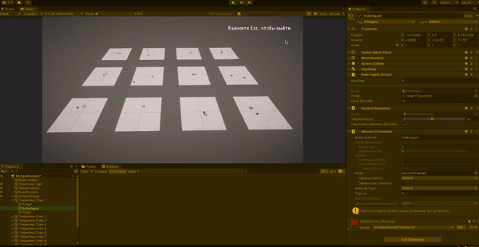
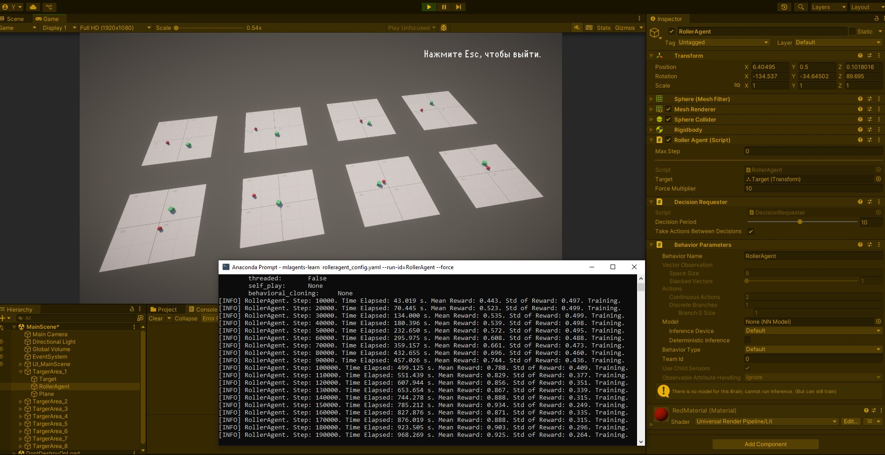
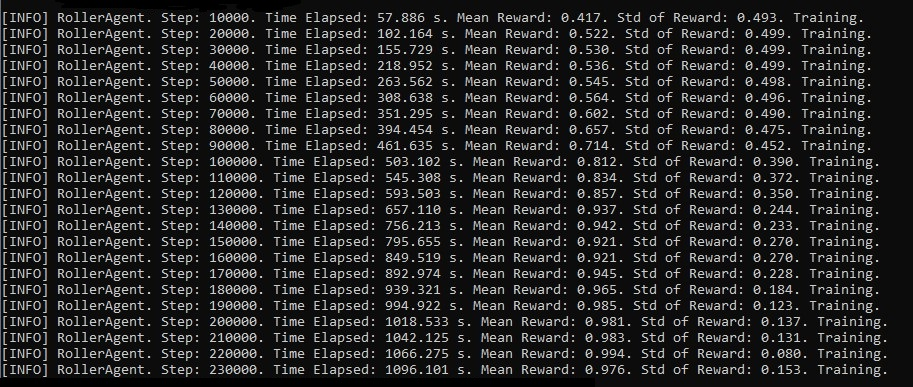
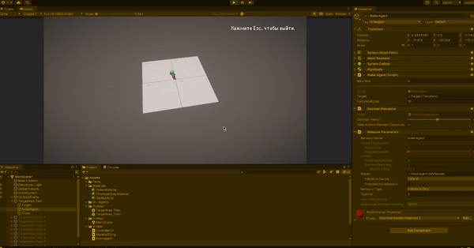
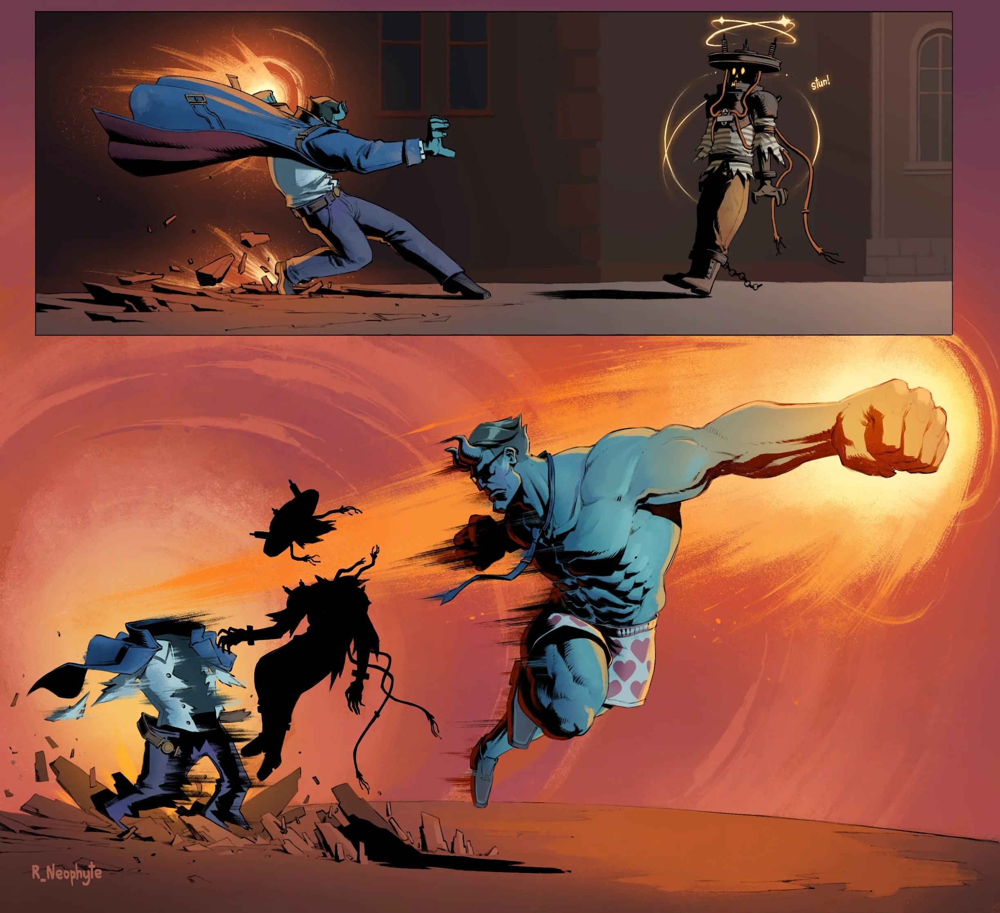

# АНАЛИЗ ДАННЫХ И ИСКУССТВЕННЫЙ ИНТЕЛЛЕКТ [AD in GameDev]
Отчет по *Лабораторной работе №5* выполнил:
- Крюков Никита Андреевич
- РИ-230915 (AT-01)

| Задание | Выполнение | Баллы |
| ------ | ------ | ------ |
| Задание 1 | * | ? |
| Задание 2 | * | ? |
| Задание 3 | * | ? | 

Работу проверили:
- к.т.н., доцент Денисов Д.В.
- к.э.н., доцент Панов М.А.
- ст. преп., Фадеев В.О.

# Цель работы
Познакомиться с программными средствами для создания системы машинного обучения и ее интеграции в Unity.

# Введение. 
## Пример - задание №1

**Постановка задачи:** в данном задании мы создадим ML-агент и будем тренировать нейронную сеть, задача которой будет заключаться в управлении шаром. Задача шара заключается в том, чтобы оставаясь на плоскости находить кубик, смещающийся в заданном случайном диапазоне координат.

Создал и настроил сцену согласна данным из методичной работы и видео с объяснением преподавателя. От себя добавил несколько более приятных материалов для сцены, простенький UI со шрифтами, по ходу выполнения задания старался соблюдать структуру проекта, а так же сам по себе проект сделал не обычный Unity 3D, а Unity URP проект, чтобы глаза не резало (более комфортно для меня). Начал обучение согласно заданию и успешно его закончил (результаты эпох обучения на фотографии ниже).

После завершения обучения протестировал, всё успешно работает. Бывает иногда ошибки обучения из-за недостаточного количества эпох... Например если зелёный кубик появился где-то далеко от красного шарика ближе к краю платформы, то шарик прикатившись к кубику не всегда на перед понимает где может появится кубик заново. Если кубик появятся где-то за спиной (грубо говоря) шарика, то шарик не успевает затормозить и вылетает с платформы. Это то, что я мог наблюдать в своём эксперименте.

Я попробовал повторить обучения, случаи когда шарик вылетает за платформы уменьшились, но полностью случаи не исключены, возможно дело в очень ограниченном пространстве и сильном разбросе появления зелёного кубика. Как мне кажется падения в этой задаче можно свести к минимуму достаточным обучением, но это не исключит такие ситуации (смотрел видео где какой-то мужчина заставлял шар удержатся на вращающийся платформе, там были моменты в который вообще не как не избежать падения из-за физики движения сферы).

Результаты тестирование:

Загрузил Unity проект с решением в репозиторий, в директорию MlAgentProject. Посмотреть можно [тут](https://github.com/ytkinroman/urfu_5/blob/main/MlAgentProject).

## Пример - задание №2
Тест...

## Задание 1
Найдите внутри C# скрипта "коэффициент корреляции" и сделать выводы о том, как он влияет на обучение модели.

Текст...

# Задание 2
Изменить параметры файла yaml-агента и определить какие параметры и как влияют на обучение модели. Привести описание не менее трех параметров.

Текст...

# Задание 3
Приведите примеры, для каких игровых задачи и ситуаций могут использоваться первый и второй примеры с ML-Agent'ом. В каких случаях проще использовать ML-агент, а не писать программную реализацию решения? 

Текст...

## Выводы
Текст...

Буду ждать комментариев по поводу моего отчёта, хорошего Вам дня !

