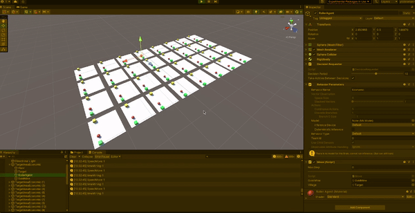
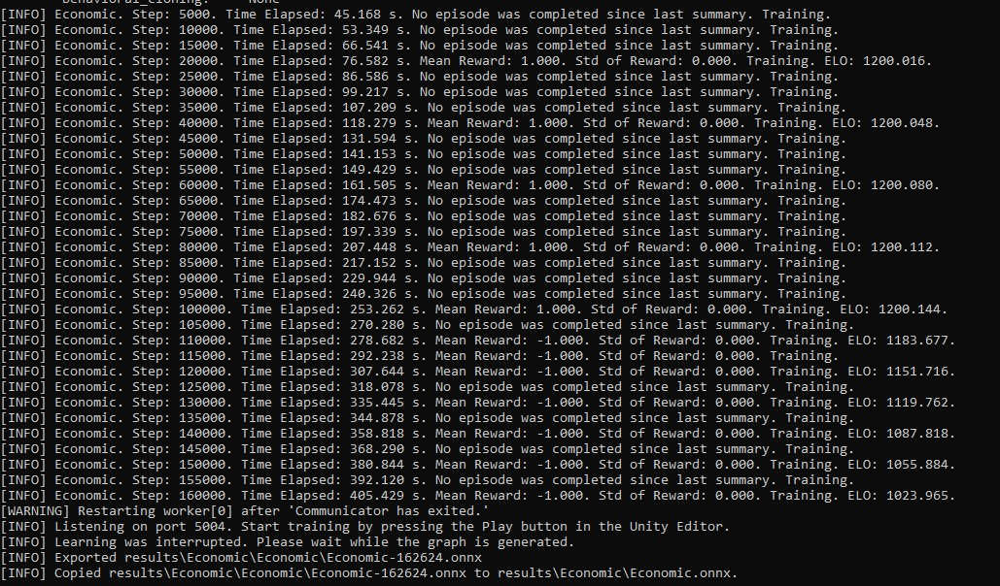
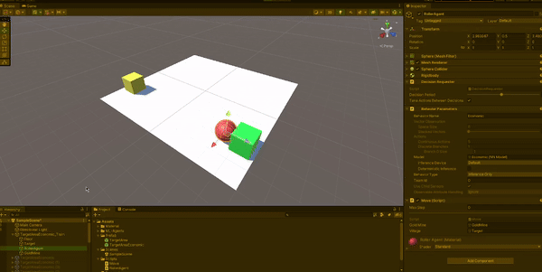
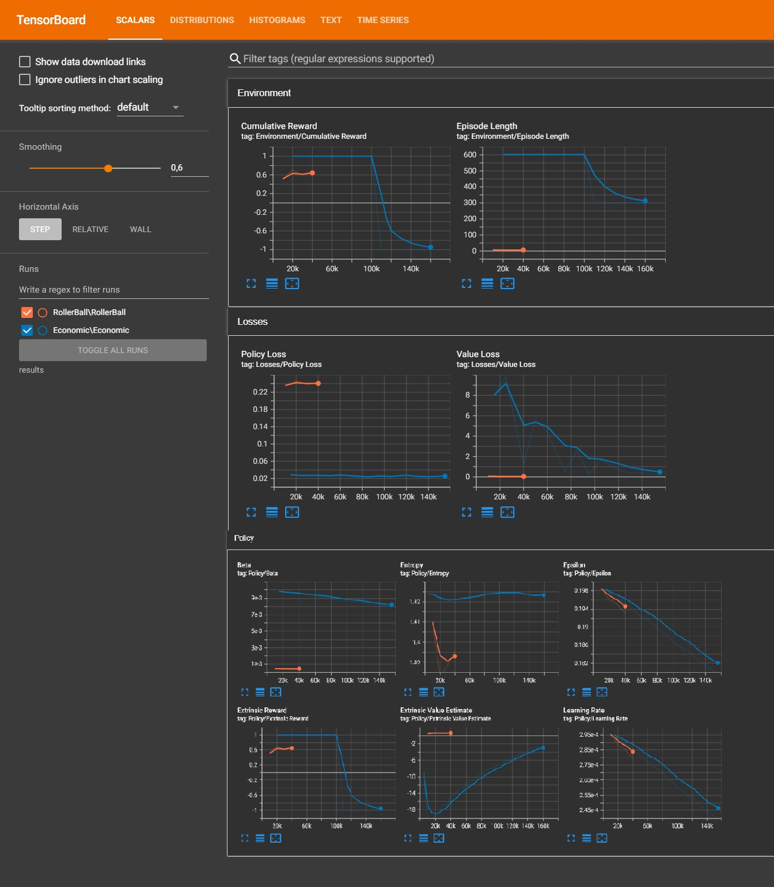
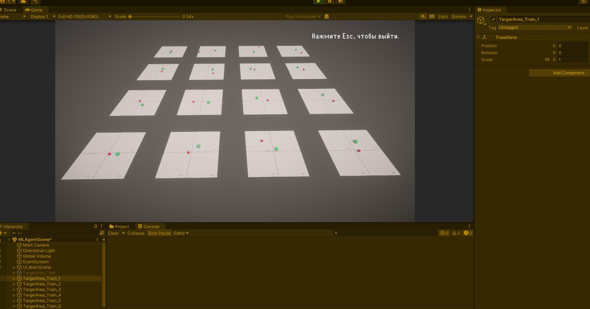
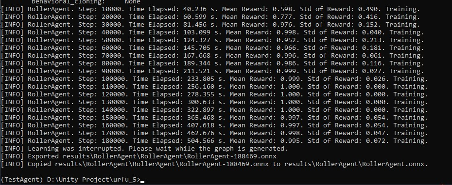
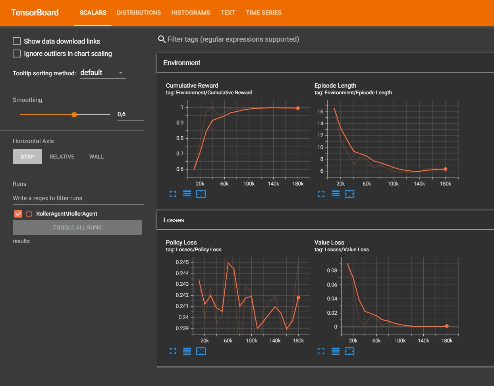

# АНАЛИЗ ДАННЫХ И ИСКУССТВЕННЫЙ ИНТЕЛЛЕКТ [AD in GameDev]
Отчет по *Лабораторной работе №5* выполнил:
- Крюков Никита Андреевич
- РИ-230915 (AT-01)

| Задание | Выполнение | Баллы |
| ------ | ------ | ------ |
| Задание 1 | * | ? |
| Задание 2 | * | ? |
| Задание 3 | * | ? | 

[Все задания выполнены]

Работу проверили:
- к.т.н., доцент Денисов Д.В.
- к.э.н., доцент Панов М.А.
- ст. преп., Фадеев В.О.


# Цель работы
Познакомиться с программными средствами для создания системы машинного обучения и ее интеграции в Unity.


# Введение

## Пример - задание №1

**Постановка задачи:** в данном задании мы создадим ML-агент и будем тренировать нейронную сеть, задача которой будет заключаться в управлении шаром. Задача шара заключается в том, чтобы оставаясь на плоскости находить кубик, смещающийся в заданном случайном диапазоне координат.


Создал и настроил сцену согласна данным из методичной работы и видео с объяснением преподавателя. От себя добавил несколько более приятных материалов для сцены, простенький UI со шрифтами, по ходу выполнения задания старался соблюдать структуру проекта, а так же сам по себе проект сделал не обычный Unity 3D, а Unity URP проект, чтобы глаза не резало (более комфортно для меня). Начал обучение согласно заданию и успешно его закончил (результаты эпох обучения на фотографии ниже).


После завершения обучения протестировал, всё успешно работает. Бывает иногда ошибки обучения из-за недостаточного количества эпох... Например если зелёный кубик появился где-то далеко от красного шарика ближе к краю платформы, то шарик прикатившись к кубику не всегда на перед понимает где может появится кубик заново. Если кубик появятся где-то за спиной (грубо говоря) шарика, то шарик не успевает затормозить и вылетает с платформы. Это то, что я мог наблюдать в своём эксперименте.

Я попробовал повторить обучения, случаи когда шарик вылетает за платформы уменьшились, но полностью случаи не исключены, возможно дело в очень ограниченном пространстве и сильном разбросе появления зелёного кубика. Как мне кажется падения в этой задаче можно свести к минимуму достаточным обучением, но это не исключит такие ситуации (смотрел видео где какой-то мужчина заставлял шар удержатся на вращающийся платформе, там были моменты в который вообще не как не избежать падения из-за физики движения сферы).


Загрузил Unity проект с решением в репозиторий, в директорию MlAgentProject. Посмотреть можно [тут](https://github.com/ytkinroman/urfu_5/blob/main/MlAgentProject). Результат выполнения ниже:


## Пример - задание №2
Согласно методическим указаниям скачал проект, настроил и запустил обучение. После завершения обучения протестировал.

Процесс обучения:



Результаты обучения:



Загрузил Unity проект с решением в репозиторий, в директорию ML-Agent_EconomicModel. Посмотреть можно [тут](https://github.com/ytkinroman/urfu_5/blob/main/ML-Agent_EconomicModel). Тестирование обучения ниже:



График для оценки результатов обучения:



Как можем рассмотреть график я немного перестарался с обучением. Агент сначала обучался очень даже хорошо, но затем произошло снижение эффективности из-за переобучения (резкие падение Cumulative Reward может свидетельствовать о проблемах в обучении).


# Задания к работе

**Примечание:** буду отвечать на задания к работе на примере первого агента т.к я самостоятельно создал его по записи с лекции и лучше разобрался в его работе.


## Задание 1
Найдите внутри C# скрипта "коэффициент корреляции" и сделать выводы о том, как он влияет на обучение модели.

Что такое корреляция? В рамках задачи, корреляция можно определить как меру, которая показывает, насколько изменения в одном параметре связаны с изменениями в другом параметре. Проще говоря, корреляция в этой задаче означает, насколько сильно и как изменения в одном параметре соответствуют изменениям в другом параметре. Это помогает понять, насколько эффективно агент реагирует на изменения в окружающей среде и как он приближается к цели.

В предоставленном скрипте коэффициент корреляции не используется напрямую. Однако, можно рассмотреть, как различные параметры и наблюдения могут коррелировать друг с другом и как это может влиять на обучение агента. Такими параметрами могут являться сила реакции *public float forceMultiplier = 10;* или максимальное расстояние, на которое агент должен приблизится к цели *1.42f*.

Я попробовал провести эксперимент и максимальное расстояние, на которое агент должен приблизится к цели до значения *2.1f*. 







Среднее вознаграждение (Mean Reward) постепенно увеличивается с течением времени. Начальное значение около 0.598 на шаге 10000 увеличивается до 1.000 на шаге 120000 и далее. Это указывает на то, что агент становится все более эффективным в достижении своей цели. После шага 110000 среднее вознаграждение стабилизируется на уровне 1.000, что свидетельствует о том, что агент достиг максимальной эффективности в выполнении своей задачи. Стандартное отклонение вознаграждения (Std of Reward) также уменьшается с течением времени. Начальное значение около 0.490 на шаге 10000 снижается до 0.000 на шаге 120000 и далее. Это указывает на то, что вознаграждения становятся более стабильными и предсказуемыми, что является признаком успешного обучения.

Исходя из эксперимента, можно сказать, что коэффициент корреляции в данном случае будет влиять на то, насколько сильно агент будет стремиться к своей цели и выискивать идеальную точку для попадания, стараясь минимизировать среднее отклонение от этой точки.


## Задание 2
Изменить параметры файла yaml-агента и определить какие параметры и как влияют на обучение модели. Привести описание не менее трех параметров.

```
behaviors:
  RollerBall:
    trainer_type: ppo        # Тип тренера, используемый для обучения агента
    hyperparameters:
      batch_size: 10         # Размер пакета данных, используемого для обновления модели
      buffer_size: 100       # Размер буфера опыта, используемого для хранения данных о взаимодействиях агента с окружающей средой
      learning_rate: 3.0e-4  # Скорость обучения, определяющая шаг градиентного спуска
      beta: 5.0e-4           # Коэффициент регуляризации для энтропии, используемый для поощрения исследования
      epsilon: 0.2       # Коэффициент, используемый для ограничения изменений политики
      lambd: 0.99        # Коэффициент, используемый для вычисления обобщенного преимущества 
      num_epoch: 3       # Количество эпох обучения на одном пакете данных
      learning_rate_schedule: linear  # Схема изменения скорости обучения (линейное уменьшение)
    network_settings:
      normalize: false   # Флаг, указывающий, нужно ли нормализовать входные данные
      hidden_units: 128  # Количество нейронов в скрытых слоях нейронной сети
      num_layers: 2      # Количество скрытых слоев в нейронной сети
    reward_signals:
      extrinsic:
        gamma: 0.99      # Коэффициент дисконтирования для внешнего сигнала вознаграждения
        strength: 1.0    # Сила внешнего сигнала вознаграждения
    max_steps: 500000    # Максимальное количество шагов обучения
    time_horizon: 64     # Длина временного горизонта для одного эпизода
    summary_freq: 10000  # Частота вывода сводной информации о процессе обучения
```


## Задание 3
Приведите примеры, для каких игровых задачи и ситуаций могут использоваться первый и второй примеры с ML-Agent'ом. В каких случаях проще использовать ML-агент, а не писать программную реализацию решения? 

Текст...


# Выводы
В процессе работы я ознакомился с различными программными средствами, используемыми для создания системы машинного обучения в Unity. Я детально разобрал два примера ML-Агентов: первый агент был предназначен для поиска постоянно перемещающейся цели, а второй агент представлял собой NPC, занимающегося добычей золота в руднике. В рамках первого задания я создал несколько вариаций с различными конфигурациями обучения.

Буду ждать комментариев по поводу моего отчёта, хорошего Вам дня !


